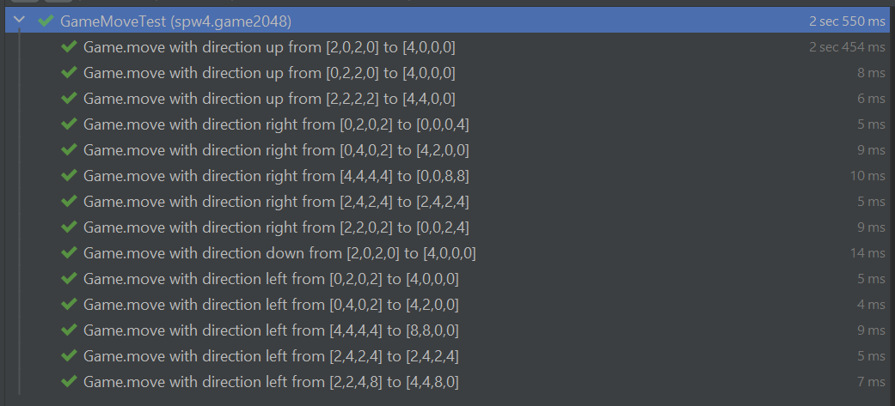
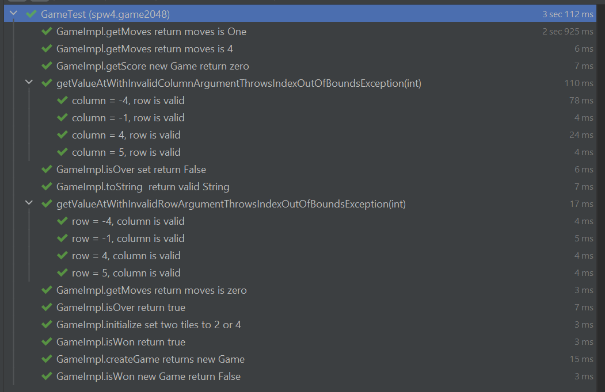

[footer,cols="1,1,1"]
|===
|SPW4 - E2 :  2048
|Birklbauer Gerald, Buttinger Xaver
|22. 05.2022
|===

== Lösungsidee

Bei der Hausübung 2 in SPW4 dürfen wir das Spiel 2048 entwickeln.
Die Entwicklung soll im Team mit 2 Personen und strikten TDD erfolgen. Unser Team besteht aus Buttinger Xaver und Birklbauer Gerald.

Zuerst müssten wir uns mit dem Spiel und den Spielregeln vertraut machen. Danach haben wir ausgiebig über die Lösungsidee diskutiert, dabei sind wir zu folgenden Ergebnis gekommen:

Wir möchten das Spiel mit einem zweidimensionalen Array umsetzten. Das Array wird die "Tiles" verwalten.
Neu Tiles müssen mit einem Verhältnis von 90% : 10% erstellt werden sollen. Für diese Aufgabe möchten wir einen Zufallsgeneration nützen, welchen wir so weit modifizieren, damit wird das Verhältnis einhalten können.

Die Bewegung möchten wir wie gefordert umsetzten, jedoch auf an die Tiles delegieren.
Für die Bewegung möchten wie wiefolg vorgehen:
    - Die äußerste Zahl der Reihe finden
    - Diese mit den Nachbarn vergleichen, falls gleich diese vereinigt
    - Falls es eine Lücke zwischen den äußersten Wert und aktuellen Wert gibt, verschieben.
    - Einschränkung: Es dürfen nur zwei Zahlen vereinigt werden. Diese Einschränkung werden wir über den Rundenzähler prüfen, welche wir implementieren müssen.

== Antworten Fragen
=== a) Beschreibung Entwicklungsprozess mit TDD

Wir haben uns entschieden, dass wir die Funktionalität von IntellJ nützen werden, wo beide gleichzeitig programmieren können.
Jedoch möchten wir alle Implementierungsschritte gemeinsam machen, daher wird eine den Code verfassen und der andere wird auf Fehlervermeidung achten.
Bevor wir eine Methode implementieren, werden natürlich eine Test schreiben, welche fehlschlägt. Nach der Implementierung werden wir Test ausführen.
Sollte der Test fehlschlagen, werden wir die Methode überarbeiten, bis der Test erfolgreich ist.

=== Notizen während der Entwicklung

* Diskussion der Lösung und festlegung eines Vorgehen mit Integer Array
* Start mit einfachen Methoden wie getMoves und getScore (Start mit Testfälle, dann Implementierung der Methode)
* Erzeugung eines RandomGeneratorStub, da wir diesen für die Methode initialize benötigen. Dadurch auch erstes Refakor vom Konstruktor.
* Nächster Schritte waren getMoves, isOver, isWon. Danach stand das nächste Refaktoring an, wo wir die BoardUtil erzeugt haben. Hier haben uns die Tests schon sehr gut geholfen.
* Beginn mit der Fahrbewegung und Merge. Hier haben wir schnell gemerkt, dass wir mit unserer ersten Lösung nicht zufrieden waren.
    Wir haben nun beschlossen, dass wir einen größeren Umbau vornehmen. (Umstellung von Integer auf Tiles). Bei diesem Schritt haben wir sehr von unseren Testfällen profitiert, da dieser großer Umbau dadurch schnell erledigt war.
* Erste echter Test. Nach einigen Zügen haben wir bemerkt, dass wir eine Situation bei den Tests übersehen haben. Diesen haben wir gleich als Testfall implementiert.
* Überprüfung Line Coverage -> war 90%. Danach haben wir für die fehlenden Lines noch Testfälle geschrieben und den Code nochmals einem Refaktorieng unterzogen.

=== b) Erfahrung mit TDD

**- Gerald: ** Ich hatte vor dieser Übung noch keine Erfahrung mit Pair Programming und TDD. Wir haben immer versucht, den TDD Prozess strikt einzuhalten, was uns zu Beginn extrem gut gelungen ist.
                In unserem Entwicklungsprozess hatten wir eine Phase, wo wir den strengen TDD Prozess kurzzeitig verlassen haben. Dies haben wir jedoch schnell bemerkt, wodurch wir gleich wieder auf das TDD Vorgehen zurückgekehrt sind.
                Wir hatten mehrere Refaktoringschritte in unserem Entwicklungsprozess, wo uns die Testfälle extrem geholfen haben und wir dadurch auch Zeit einsparen konnten, welche wir durch die Test benötigt haben.
                Ich denke, dass sich TDD für die Wartung eines langlebigen Softwareprodukts extrem gut eignet. Eine wichtige Erkenntnis für mich war, dass man sich die Testfälle extrem gut überlegen muss und diese korrekt implementieren muss.

== SouceCode

### Game Interface
[source, java, linenums ]
----
include::../src/main/java/spw4/game2048/Game.java[]
----

### Game Implementierung
[source, java, linenums ]
----
include::../src/main/java/spw4/game2048/GameImpl.java[]
----

### BoardUtil  Interface
[source, java, linenums ]
----
include::../src/main/java/spw4/game2048/BoardUtil.java[]
----

### BoardUtil  Implementierung
[source, java, linenums ]
----
include::../src/main/java/spw4/game2048/BoardUtilImpl.java[]
----

### GameRandomGenerator Interface
[source, java, linenums ]
----
include::../src/main/java/spw4/game2048/GameRandomGenerator.java[]
----

### GameRandomGenerator  Implementierung
[source, java, linenums ]
----
include::../src/main/java/spw4/game2048/GameRandomGeneratorImpl.java[]
----

### Main
[source, java, linenums ]
----
include::../src/main/java/spw4/game2048/Main.java[]
----

### Direction
[source, java, linenums ]
----
include::../src/main/java/spw4/game2048/Direction.java[]
----

### Testfall: BoardUtilTest
[source, java, linenums ]
----
include::../src/test/java/spw4/game2048/BoardUtilTest.java[]
----

### Testfall: GameMoveTest
[source, java, linenums ]
----
include::../src/test/java/spw4/game2048/GameMoveTest.java[]
----

### Testfall: GameRandomGeneratorStub
[source, java, linenums ]
----
include::../src/test/java/spw4/game2048/GameRandomGeneratorStub.java[]
----

### Testfall: GameTest
[source, java, linenums ]
----
include::../src/test/java/spw4/game2048/GameTest.java[]
----

### Testfall TwoOrFourGeneratorTest
[source, java, linenums ]
----
include::../src/test/java/spw4/game2048/TwoOrFourGeneratorTest.java[]
----

### Testfall TileTest
[source, java, linenums ]
----
include::../src/test/java/spw4/game2048/TileTest.java[]
----

== Testfälle

=== BoardUtilTest

=== GameMoveTest

=== GameTest

=== TileTest

=== GameRandomGeneratorTest

=== Line Coverage
Line Coverage 100% -> Main Methode wurde von uns nicht betrachtet, da wir diese erhalten haben.

